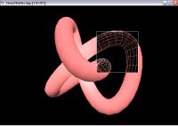



## Knot

### Description

Rotating solid knot wireframed in small window. Example of using StencilBuffer function in OpenGL.
 
### More Info
 

             |
---                |---
**Submitted On**   |2003-09-14 13:37:24
**By**             |[Jan Tosovsky](https://github.com/Planet-Source-Code/PSCIndex/blob/master/ByAuthor/jan-tosovsky.md)
**Level**          |Intermediate
**User Rating**    |5.0 (15 globes from 3 users)
**Compatibility**  |VB 5\.0, VB 6\.0
**Category**       |[Graphics](https://github.com/Planet-Source-Code/PSCIndex/blob/master/ByCategory/graphics__1-46.md)
**World**          |[Visual Basic](https://github.com/Planet-Source-Code/PSCIndex/blob/master/ByWorld/visual-basic.md)
**Archive File**   |[Knot16715511132003\.zip](https://github.com/Planet-Source-Code/jan-tosovsky-knot__1-49880/archive/master.zip)

